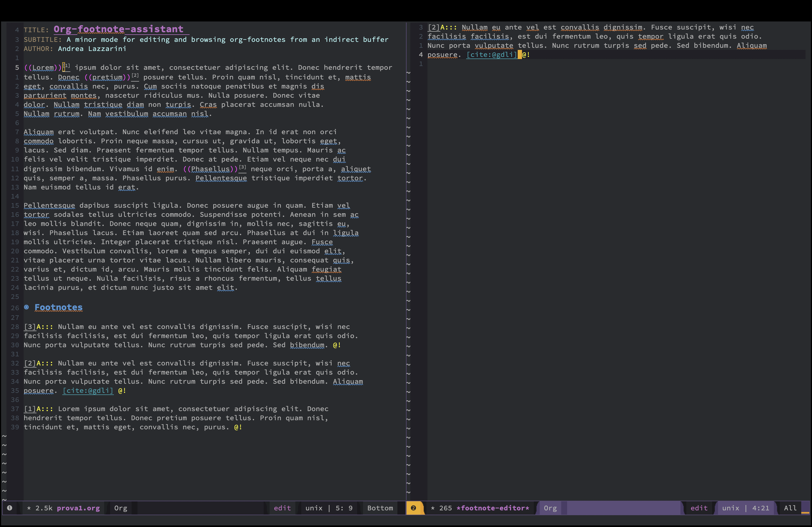

# Org-footnote-assistant
A minor mode for editing and browsing org-footnotes from an indirect buffer in a
side window.

This package provides additional functionality to Emacs Org mode for handling
footnotes. It defines functions that allow the user to navigate between footnote
references and their definitions, and to edit the definitions in a separate
buffer.

This could help to overcoming the limited inline viewing of org-mode footnotes
(since the content of the footnotes is not directly visible from the text and
viceversa). This makes it harder to review or modify the content; navigating
between footnote references and their corresponding content can also be
cumbersome, and this can disrupt the flow of reading or writing.

The 'org-footnote-assistant--show-definition' function narrows and indirect
buffer to the region of the current footnote definition, if the point is
currently at a footnote reference. The
'org-footnote-assistant--create-editor-window' function creates a new buffer or
selects an existing buffer named "*footnote-editor*", narrows it to the footnote
definition region, and switches to it. The
'org-footnote-assistant--goto-next-footnote' function finds the next or previous
footnote reference and opens the narrowed buffer. The
'org-footnote-assistant--goto-definition' temporarily overwrites the
org-footnote-goto-definition to work with the side buffer.

